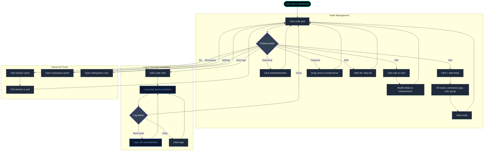

# Nexus
### Premium Node Control Center

Nexus is a powerful, real-time dashboard designed for developers and system administrators to manage, monitor, and interact with multiple nodes from a single, sleek interface. Built with **Vue 3** and **Node.js**, it provides a robust set of tools for modern development workflows.

---

## 🚀 Key Features

### 🖥️ Interactive Dashboard
*   **Real-time Monitoring**: View node statuses, PIDs, and resource indicators at a glance.
*   **Intuitive Grid Layout**: Drag-and-drop to reorder node cards or move them between custom groups.
*   **Bulk Actions**: Start, stop, or restart all nodes in a group or globally with one click.

### 📟 Advanced Terminal Console
*   **Full PTY Support**: High-fidelity terminal emulation using `node-pty` for interactive CLI tools.
*   **ANSI Color Support**: Pristine rendering of terminal output, including complex color schemes and progress bars.
*   **Interactive Stdin**: Send input directly to running nodes for TUI prompts and user interaction.

### 📂 Integrated Workspace
*   **In-Browser File Manager**: Browse, search, and manage directories directly within the node workspace.
*   **Code Editor**: Edit configuration files or source code on the fly without leaving the dashboard.
*   **Smart Search**: Fast, content-aware search across your project files.

### 🌿 Git & AI Integration
*   **Branch Awareness**: View active Git branches for each node directory and switch branches directly from the UI.
*   **AI Command Assistance**: Built-in integration for **Gemini** and **Claude** to help generate commands or debug logs.

### ⚙️ Flexible Configuration
*   **Template Support**: Use `{ENV_VAR}` placeholders in paths and arguments.
*   **Environment Management**: Edit and persist project-wide environment variables via a dedicated modal.

---

## 🛠️ Tech Stack

*   **Frontend**: Vue 3, Vite, Lucide Icons, Mermaid
*   **Backend**: Node.js, Express, WebSocket (ws), node-pty
*   **Dev Tools**: Tailored for high-performance node spawning and log management.

---

## 🔄 User Flow



---

## 📦 Getting Started

### Prerequisites
- **Node.js** (LTS recommended)
- **Git**

### Installation
```bash
# Clone the repository
git clone <repository-url>
cd nexus

# Install dependencies
npm install
```

### Configuration
1.  **processes.config.json**: (Required) Create an array of node definitions.
    ```json
    [
      {
        "name": "Backend API",
        "command": "npm",
        "args": ["run", "dev"],
        "cwd": "/path/to/backend",
        "group": "backend"
      }
    ]
    ```
2.  **env.config.json**: (Optional) Key-value pairs for environment variables.

### Running
```bash
npm start
```
The dashboard will be available at **http://localhost:1337**.

---

## ⚖️ License & Disclaimer

This software is provided for **legitimate system administration and development purposes only**. It executes arbitrary commands as configured by the user and provides no sandboxing or authentication by default. **Do not expose it to untrusted networks.**

See [NOTICE](NOTICE) and [LICENSE](LICENSE) for details.
