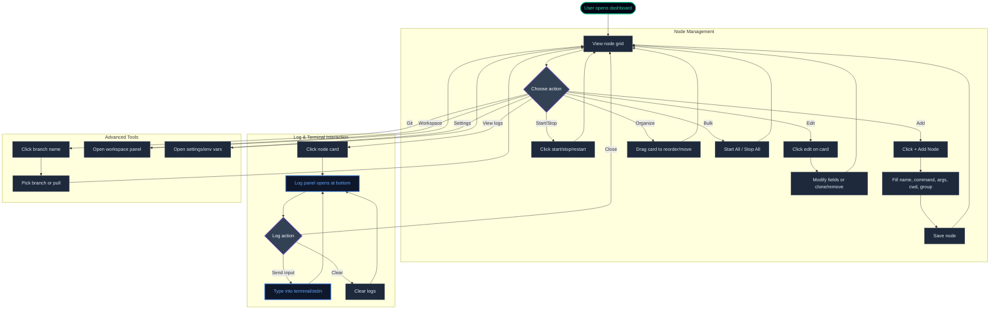

# User Flow

```mermaid
graph TD
    %% Main Flow
    Start([User opens dashboard]) --> View[View node grid]
    View --> Action{Choose action}

    %% Subgraphs for visual grouping
    subgraph Node Management
        Action -->|Add| Add[Click + Add Node]
        Add --> Fill[Fill name, command, args, cwd, group]
        Fill --> Save[Save node]
        Save --> View

        Action -->|Start/Stop| Control[Click start/stop/restart]
        Control --> View

        Action -->|Edit| Edit[Click edit on card]
        Edit --> Modify[Modify fields or clone/remove]
        Modify --> View
        
        Action -->|Organize| Org[Drag card to reorder/move]
        Org --> View
        
        Action -->|Bulk| Bulk[Start All / Stop All]
        Bulk --> View
    end

    subgraph Log & Terminal Interaction
        Action -->|View logs| Select[Click node card]
        Select --> Logs[Log panel opens at bottom]
        Logs --> LogAction{Log action}
        
        LogAction -->|Send input| Stdin[Type into terminal/stdin]
        Stdin --> Logs
        
        LogAction -->|Clear| Clear[Clear logs]
        Clear --> Logs
        
        LogAction -->|Close| View
    end

    subgraph Advanced Tools
        Action -->|Git| Branch[Click branch name]
        Branch --> BranchPick[Pick branch or pull]
        BranchPick --> View

        Action -->|Workspace| Workspace[Open workspace panel]
        Workspace --> View

        Action -->|Settings| Settings[Open settings/env vars]
        Settings --> View
    end

    %% Apply Premium Styling
    classDef default fill:#1e293b,stroke:#334155,stroke-width:1px,color:#e2e8f0;
    classDef decision fill:#334155,stroke:#8b5cf6,stroke-width:2px,color:#f8fafc;
    classDef terminal fill:#0f172a,stroke:#3b82f6,stroke-width:2px,color:#60a5fa;
    classDef start fill:#020617,stroke:#10b981,stroke-width:2px,color:#34d399;

    class Action,LogAction decision;
    class Start start;
    class Stdin,Logs terminal;
```
